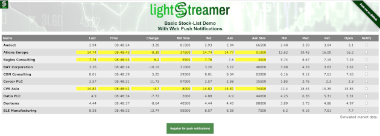
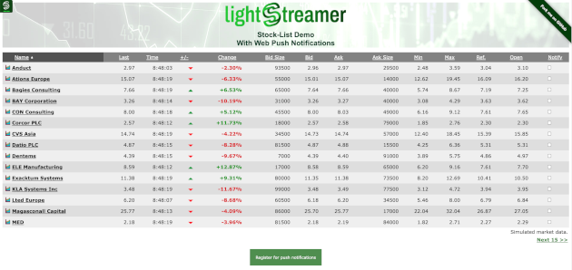

# Lightstreamer - Stock-List Demos with Web Push Notifications - HTML Clients

This project includes different demos based on [Lightstreamer - Stock-List Demo - Java Adapter](https://github.com/Lightstreamer/Lightstreamer-example-Stocklist-adapter-java) with the use of web push notifications, i.e. the technology equivalent to mobile push notifications (MPN) but for a browser/desktop environment.

* Basic MPN Stock-List Demo
* MPN Stock-List Demo


## Basic Stock-List Demo with Web Push Notifications - HTML Client
<!-- START DESCRIPTION lightstreamer-example-stocklist-client-javascript-basic-stock-list-demo-with-web-push-notifications---html-client -->

### Live Demo

[](http://demos.lightstreamer.com/MPNStockListDemo_Basic)

### [ View live demo](https://demos.lightstreamer.com/MPNStockListDemo_Basic/)

### Details

This demo displays real-time market data for 10 stocks, generated by a feed simulator. Each stock may optionally send a push notification when its price changes.

This page uses the [Web Client SDK API for Lightstreamer](https://lightstreamer.com/api/ls-web-client/latest/) to handle the communications with Lightstreamer Server. A simple user interface is implemented to display the real-time data received from Lightstreamer Server. By activating the optional notification checkbox, the user receives a web push notification at each price change of the selected stock, even when the page is not currently open.

The demo includes the following client-side functionalities:

* A [Subscription](https://lightstreamer.com/api/ls-web-client/latest/Subscription.html) containing 10 items, subscribed to in **MERGE** mode feeding a [StaticGrid](https://lightstreamer.com/api/ls-web-client/latest/StaticGrid.html).
* An optional [MPN Subscription](https://lightstreamer.com/api/ls-web-client/latest/MpnSubscription.html) sending web push notifications even when the page is not open.

<!-- END DESCRIPTION lightstreamer-example-stocklist-client-javascript-basic-stock-list-demo-with-web-push-notifications---html-client -->


## Stock-List Demo with Web Push Notifications - HTML Client
<!-- START DESCRIPTION lightstreamer-example-stocklist-client-javascript-stock-list-demo-with-web-push-notifications---html-client -->

### Live Demo

[](http://demos.lightstreamer.com/MPNStockListDemo)

### [ View live demo](https://demos.lightstreamer.com/MPNStockListDemo/)

### Details

This demo shows some further features with respect to the [Basic MPN Stock-List Demo](https://github.com/Lightstreamer/Lightstreamer-example-MPNStockList-client-javascript#basic-stock-list-demo-with-web-push-notifications---html-client).

Click on the stock names to open pop-up windows that display real-time streaming charts. Notice that the maximum update frequency set for the pop-up windows is greater than the frequency set for the main window. The data is resampled by Lightstreamer Server, according to the maximum frequency requested by each table (you can easily notice that if you open "Ations Europe").

Click on the link under the table (Next/Previous 15) to dynamically switch between two lists of fifteen items, without losing previously opened pop-ups. If you open the same demo in different browser windows, you will see slightly different values for the most updated stocks. Again, this behavior shows how the data resampling is done in real-time on a per-window basis.

On the pop-up windows set a web push notification to be sent when the price reaches a high or low threshold. The notification is sent even if both the pop-up window and the main page are not currently open.

The demo includes the following client-side functionalities:

* A [Subscription](https://lightstreamer.com/api/ls-web-client/latest/Subscription.html) containing 15 items, subscribed to in **MERGE** mode feeding a [DynaGrid](https://lightstreamer.com/api/ls-web-client/latest/DynaGrid.html).
* An optional [MPN Subscription](https://lightstreamer.com/api/ls-web-client/latest/MpnSubscription.html) sending web push notifications even when the page is not open.
* For each pop-up window opened, a [Subscription](https://lightstreamer.com/api/ls-web-client/latest/Subscription.html) containing 1 item, subscribed to in **MERGE** mode feeding both a [StaticGrid](https://lightstreamer.com/api/ls-web-client/latest/StaticGrid.html) and a [Chart](https://lightstreamer.com/api/ls-web-client/latest/Chart.html).
* For each pop-up window opened, an optional [MPN Subscription](https://lightstreamer.com/api/ls-web-client/latest/MpnSubscription.html) with a trigger set to send a web push notification when the price reaches a high or low threshold.

<!-- END DESCRIPTION lightstreamer-example-stocklist-client-javascript-stock-list-demo-with-web-push-notifications---html-client -->


## Install

A full local deploy of this app requires a Lightstreamer Server 7.1 or greater installation with appropriate Mobile Push Notifications (MPN) module configuration. A detailed step by step guide for setting up the server and configuring the client is available in the README of the following project:

* [Lightstreamer - MPN Stock-List Demo Metadata - Java Adapter](https://github.com/Lightstreamer/Lightstreamer-example-MPNStockListMetadata-adapter-java)

You can deploy these demos to use the Lightstreamer server as Web server or in any external Web Server you are running.
If you choose the former case, please create the folders `<LS_HOME>/pages/[demo_name]` then copy here the contents of the `src/[demo_name]` folder of this project.<br>
The client demos configuration assumes that Lightstreamer Server, Lightstreamer Adapters, and this client are launched on the same machine. If you need to target a different Lightstreamer server, please search this line:
```js
var lsClient = new LightstreamerClient(protocolToUse+"//localhost:"+portToUse,"DEMO");
```
in `index.js` or `index.html`, depending on the demo, and change it accordingly.<br>

The demos are now ready to be launched.

## Firebase basic API

Handling of the messages depends on whether the page is in the foreground or in the background.
In any cases, the first step is to create a service worker in the file `firebase-messaging-sw.js`.

```javascript
importScripts('https://www.gstatic.com/firebasejs/7.7.0/firebase-app.js');
importScripts('https://www.gstatic.com/firebasejs/7.7.0/firebase-messaging.js');

firebase.initializeApp({
    // Firebase configurations
});

const messaging = firebase.messaging();
```
(see `firebase-messaging-sw.js` for the complete code)

Then, if the app is in the foreground, the messages can be received directly in the page by registering a listener for the event `onMessage`.

```javascript
messaging.onMessage((payload) => {
  console.log('Message received. ', payload);
});
```
(see `lsMpn.js` for the complete code)

On the other hand, if the app is in the background, because it is closed or behind other tabs, you can display a notification in the browser by setting a callback to the method `setBackgroundMessageHandler` in the service worker.

```javascript
messaging.setBackgroundMessageHandler(function(payload) {
  // Customize notification here
  const notificationTitle = 'Background Message Title';
  const notificationOptions = {
    body: 'Background Message body.',
    icon: '/firebase-logo.png'
  };
  return self.registration.showNotification(notificationTitle,   notificationOptions);
});
```
(see `firebase-messaging-sw.js` for the complete code)

For further information, consult the [Firebase docs](https://firebase.google.com/docs/cloud-messaging/js/receive).


## Safari Push Notifications basic API

Handling push notifications for Safari is a zero-code matter, since they are received and displayed directly
by the macOS operating system. In fact, they are shown whatever the state of the web application is at the moment
they are delivered: foreground, background, or even when Safari is completely closed.

The authorization process, though, can be tricky and requires configuring an appropriate *push package file*
on the Server, which Safari requests and matches with the web application. Only if they match, Safari asks
the user it they permit push notifications or not.

Typically, your code for the authorization process starts by distinguishing the Safari case from the Firebase case,
preparing the permissions API callback and finally checking for existing permissions:

```javascript
if (window.safari != undefined) {

  // Safari case, prepare the permissions API callback
  var checkRemotePermission = function(permissionData) {
    if (permissionData.permission === 'default') {

      // Request permissions, the callback is this same function
      window.safari.pushNotification.requestPermission(
        WEB_SERVICE_URL,
        WEBSITE_PUSH_ID,
        USER_INFO,
        checkRemotePermission);

    } else if (permissionData.permission === 'denied') {

      // Either the user denied permissions or there is a mismatch with push package file
      alert("Push notification permissions denied");

    } else if (permissionData.permission === 'granted') {

      // The user granted permissions
      alert("Push notification permissions granted");
    }
  };

  // Check permissions to send push notifications
  var permissionData = window.safari.pushNotification.permission(APPLE_WEBSITE_PUSH_ID);
  checkRemotePermission(permissionData);

} else {

  // Firebase case, see previous sections
  [...]
}
```

Remember that requesting for permissions must be done in a user-driven event, such as
the click of a button, or permissions are denied automatically.

For further information:
* The `lsMpn.js` file contains a full example of the authorization process.
* The *General Concepts* document contains a detailed explanation on how to configure
  the Server for push notifications on Safari, including how to prepare the push package file.
* Full documentation of Safari Push Notifications API can be found on the [Apple developer website](https://developer.apple.com/library/archive/documentation/NetworkingInternet/Conceptual/NotificationProgrammingGuideForWebsites/PushNotifications/PushNotifications.html).


## See Also

### Lightstreamer Adapters Needed by These Demo Clients
<!-- START RELATED_ENTRIES -->

* [Lightstreamer - Stock- List Demo - Java Adapter](https://github.com/Lightstreamer/Lightstreamer-example-Stocklist-adapter-java)
* [Lightstreamer - MPN Stock-List Demo Metadata - Java Adapter](https://github.com/Lightstreamer/Lightstreamer-example-MPNStockListMetadata-adapter-java)

<!-- END RELATED_ENTRIES -->

### Related Projects

* [Lightstreamer - Stock-List Demo with APNs Push Notifications - iOS Client](https://github.com/Lightstreamer/Lightstreamer-example-MPNStockList-client-ios)
* [Lightstreamer - Stock-List Demo with FCM Push Notifications - Android Client](https://github.com/Lightstreamer/Lightstreamer-example-MPNStockList-client-android)
* [Lightstreamer - Stock-List Demos - HTML Clients](https://github.com/Lightstreamer/Lightstreamer-example-Stocklist-client-javascript)


## Lightstreamer Compatibility Notes

* Code compatible with Lightstreamer Web Client Library version 8.0.0 or newer.
* For Lightstreamer Server version 7.1 or greater.
